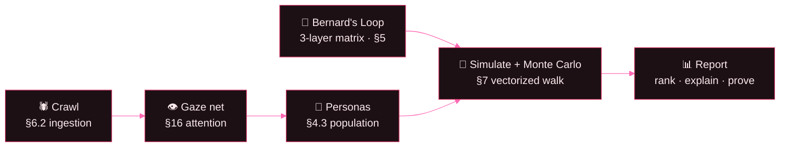

<div align="center">



<br/>


</div>

---

> **Perseus hands a business back the truth about its own funnel.**
> Give it a link. It crawls the pages, *reads* each one the way an eye would, builds a population of imaginary buyers matched to your real traffic, and walks every one of them through the funnel. Most of them leave somewhere. Perseus reports **where** they left, **how close** they were to buying when they did, and **what to change** — then makes you prove the change on live traffic before anything ships.

Everything on screen is **synthetic** — no live traffic, no real customers (spec §B7). This is a concept build where the whole simulation engine actually runs.

<br/>

## ✦ How it works

The engine is a pipeline. A URL goes in one end; a ranked, explainable report comes out the other.



1. **🕷️ Crawl (§6.2)** — `httpx` + BeautifulSoup fetch the URL and a few same-domain funnel pages (pricing, book, about…), splitting them into typed **touchpoints** with a stage and channel.
2. **👁️ Gaze net (§16 · Medusa's Gaze)** — a small NumPy attention network reads each touchpoint into where the eye lands (**attention**), how scattered it is (**entropy**), and the **appeal vector `F_j`** the visitor actually absorbs.
3. **👥 Personas (§4.3)** — a population is drawn from five named archetypes; *who* arrives depends on the channel.
4. **🧬 Bernard's Loop (§5)** — a `state × appeal` weight matrix, layered **global → niche → personal** with shrinkage `λ = n/(n+k)`, is what turns an appeal into a change of heart.
5. **🎲 Simulate + Monte Carlo (§7)** — the whole population walks the funnel as one vectorized pass, `Vₜ₊₁ = g(Vₜ, F_j)`; run many times for a **distribution with confidence intervals**, not a false-precision point estimate.
6. **📊 Report** — where people leave, how close they were, which fix pays back the most.

<br/>

## ✦ The codenames

| Codename | Spec | What it is |
|---|---|---|
| 🧬 **Bernard's Loop** | §5 | Layered calibration — the 3-matrix prior that shrinks toward *this* business as evidence arrives. |
| 🛡️ **Aegis Shield** | §8 | The extraction gate — nothing gets ranked on a touchpoint the reader couldn't read cleanly. |
| 👁️ **Medusa's Gaze** | §16 | The attention layer — scanpath, fixation entropy, and perceived time. |

<br/>

## ✦ Meet the personas

They walk the *same* funnel and behave completely differently — that's the point.

| | Persona | Reads the funnel as… | Dies at |
|---|---|---|---|
| 🩷 | **The Ready Buyer** | "just clear the path" | over-choice, not proof |
| ❤️ | **The Skeptic** | "prove it or I'm gone" | the unbacked hero |
| 🩰 | **The Bargain Hunter** | "what's the number?" | the pricing page |
| 🔵 | **The Researcher** | "let me compare everything" | clutter & paralysis |
| 💜 | **The Window Shopper** | "eh, maybe later" | the first friction |

<br/>

## ✦ The screens

| Screen | Spec | Shows |
|---|---|---|
| **Touchpoint map** | §6.2 | Every crawled touchpoint as a channel × stage grid, ranked by friction θ. |
| **Variants & gate** | §6.1 | SHAP attribution, LLM candidate arms, and the promotion gate (nothing auto-ships). |
| **Simulation replay** | §10 | Where the 100 go — animated flow, drop-off table, and the fix-this-first ranking. |
| **Who converts** | §7 | Cohorts by drop point, a morphing state radar, and convertibility. |
| **Personas & crawl** | §4.3 | 🌟 Live persona crawlers walking a glass funnel, Monte Carlo spread, the Bernard matrix. |
| **Medusa's Gaze** | §16 | The attention network + scanpath heat + fixation entropy. |
| **Bernard's Loop** | §5 | The three layers, pull strength, and posterior provenance. |
| **Bottlenecks** | §9 | The sixteen tracked open problems — the honesty ledger. |

<br/>

## ✦ Design & motion

Perseus is dark, glassy, and alive — burgundy-to-hot-pink on a near-black ground.

**Palette**

| | | |
|---|---|---|
| `#120a0f` void | `#a3123f` wine | `#ff69b4` hot pink |
| `#d0305e` rose | `#ff4d6d` alert red | `#f7b7cd` blush |
| `#7b93d4` prior blue | `#c07ba8` mauve | `#fbe9ec` ink |

**Type** — Space Grotesk (display) · Inter (nav) · JetBrains Mono (data).

**Motion** — every surface moves with intent:

- 🌌 a cursor-reactive **particle constellation** + spotlight behind everything
- 🧠 a live **neural attention network** on canvas (signals travel the edges)
- 🕸️ **persona crawlers** descending a glass funnel, dropping or converting in real time
- 🃏 **3D tilt + glare** cards, gradient-**shimmer** headings, animated glow borders
- 📈 **count-up** numbers, draw-in charts, a morphing **radar**, screen-to-screen transitions

All of it respects `prefers-reduced-motion`.

<br/>

## ✦ Quickstart

Two processes, run from the project root. First run installs deps.

**Backend** — the crawler + simulation engine (port 8000)

```bash
pip install -r backend/requirements.txt
python -m uvicorn backend.main:app --reload --port 8000
```

**Frontend** — the Vite/React UI (port 5173)

```bash
cd frontend
npm install
npm run dev
```

Then open **http://localhost:5173**, sign in (any values), and paste a **real** URL on the intake screen — e.g. `https://www.python.org` — to crawl and simulate.

> Vite proxies `/api/*` → `http://127.0.0.1:8000`, and the UI falls back to bundled sample data if the backend is down. In **PyCharm**: right-click `backend/run.py` → Run for the API, and `npm run dev` in a terminal for the UI.

<br/>

## ✦ Project structure

```
perseus/
├─ backend/
│  ├─ main.py                 FastAPI app + /api routes
│  ├─ run.py                  uvicorn launcher
│  └─ engine/                 the ML core (hand-built)
│     ├─ crawler.py           §6.2  fetch + parse → touchpoints
│     ├─ features.py                offline heuristic reader
│     ├─ eyes.py              §16   attention / gaze network
│     ├─ personas.py          §4.3  archetypes + population
│     ├─ bernard.py           §5    3-layer weight matrix
│     ├─ simulate.py          §7    vectorized walk + Monte Carlo
│     ├─ pipeline.py                orchestrator
│     └─ sample.py                  fallback funnel
└─ frontend/
   └─ src/
      ├─ components/          Background, NeuralNet, PersonaJourney, charts, Tilt…
      ├─ screens/             Login, Intake, Loading, AppShell
      │  └─ app/              the eight analysis screens
      ├─ data.js  api.js  report-context.jsx  styles.css
```

<br/>


The **Bottlenecks** screen tracks sixteen unresolved problems in the open (B1–B16): the promotion policy isn't defined, the gaze net has no training signal yet, the entropy↔time constants are uncalibrated. Synthetic significance is **never** reported as real evidence — a simulated result becomes evidence only when the same pattern shows up in live traffic.

<div align="center">
<br/>

<br/><br/>
<sub><b>PROJECT PERSEUS</b> · v4.0.0-draft · concept / pre-implementation · single-engine scope</sub><br/>
<sub><i>The nebula sits in Orion.</i></sub>
</div>
